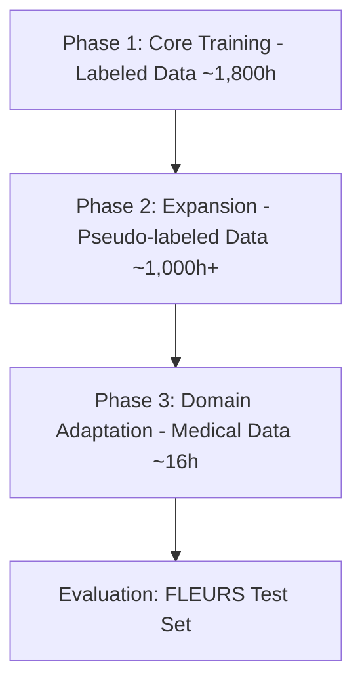

# BÁO CÁO TỔNG HỢP METADATA CÁC BỘ DỮ LIỆU ASR TIẾNG VIỆT
*(Dataset Synthesis Report)*

---

## I. BẢNG SO SÁNH TỔNG QUAN (OVERVIEW COMPARISON)

Dưới đây là bảng tổng hợp thông số kỹ thuật chính của 8 bộ dữ liệu:

| STT | Tên Dataset | Hugging Face Repository | Tổng số giờ (Duration) | Tổng số mẫu (Samples) | Sample Rate | Dạng Nhãn (Label Type) | Giấy Phép (License) |
| :--- | :--- | :--- | :--- | :--- | :--- | :--- | :--- |
| 1 | **VietSpeech** | `NhutP/VietSpeech` | `~1,100` giờ | `~1,030,000` | 16 kHz | Labeled (Human) | CC-BY-NC-SA-4.0 |
| 2 | **viVoice** | `doof-ferb/viVoice` | `~1,017` giờ | `~887,000` | **24 kHz** | Pseudo-labeled | CC-BY-NC-SA-4.0 |
| 3 | **VietBud500** | `linhtran92/viet_bud500` | `~500` giờ | `~649,000` | 16 kHz | Labeled (Verified) | Gated / Tùy biến |
| 4 | **FPT FOSD** | `doof-ferb/fpt_fosd` | `~100` giờ | `~25,900` | 16 kHz | Labeled (Human) | CC-BY-4.0 |
| 5 | **VLSP 2020** | `doof-ferb/vlsp2020_vinai_100h` | `~100` giờ | `~56,400` | 16 kHz | Labeled (Human) | CC-BY-4.0 |
| 6 | **VietMed Labeled** | `doof-ferb/VietMed_labeled` | `~16` giờ | `~9,200` | 16 kHz (gốc 8k/16k) | Labeled (Medical) | CC-BY-NC-ND-4.0 |
| 7 | **FLEURS vi_vn** | `google/fleurs` (vi_vn) | `~12` giờ | `4,416` | 16 kHz | Labeled (Human) | CC-BY-4.0 |
| 8 | **GigaSpeech 2** | `doof-ferb/gigaspeech2_vie` | `~11` giờ* | `11,035` | 16 kHz | Pseudo-labeled | Apache-2.0 |

*Ghi chú: Dung lượng GigaSpeech 2 hiển thị ở bảng trên là thông tin bản mirror nhỏ gọn. Bản gốc `speechcolab/gigaspeech2` có quy mô lớn hơn nhiều (~6,000h).*

---

## II. LỘ TRÌNH HUẤN LUYỆN (TRAINING PIPELINE PHASES)

Do kiến trúc Zipformer đã được cải tiến và không thể sử dụng checkpoint cũ, lộ trình huấn luyện từ đầu (from scratch) được chia thành **3 phase chính** để mô hình học từ dễ đến khó và tránh diverge:

### 🔴 Phase 1: Core Training (Dữ liệu nhãn sạch do con người xác thực - ~1,800 giờ)
*   **Các Dataset sử dụng:** `VietSpeech` (~1,100h), `VietBud500` (~500h), `FPT FOSD` (~100h), `VLSP 2020` (~100h).
*   **Mục đích:** Huấn luyện nền tảng Acoustic Model (AM) trên dữ liệu sạch, phát âm chuẩn và nhãn có độ chính xác cao. giúp mô hình Zipformer cải tiến hội tụ nhanh mà không bị noise phá vỡ cấu trúc trọng số ban đầu.

### 🟡 Phase 2: Training Expansion (Dữ liệu nhãn tự động/Pseudo-labeled - ~1,000 giờ+)
*   **Các Dataset sử dụng:** `viVoice` (~1,017h), `GigaSpeech 2` (~11h+).
*   **Mục đích:** Mở rộng vốn từ vựng (vocabulary), làm quen với môi trường âm thanh thực tế (YouTube/Podcast) và đa dạng hóa tốc độ nói.
*   **Lưu ý:** Cần chạy Whisper-large-v3-turbo lọc lại nhãn và lọc chất lượng audio (VAD) trước khi đưa vào.

### 🟢 Phase 3: Domain Adaptation (Tùy chọn - ~16 giờ)
*   **Các Dataset sử dụng:** `VietMed Labeled` (~16h).
*   **Mục đích:** Tối ưu hóa mô hình cho các thuật ngữ chuyên ngành y học, tên thuốc, giao tiếp Telehealth. Chỉ nên thực hiện sau khi mô hình đã hội tụ tốt ở Phase 2.

### 🔵 Evaluation Benchmark (Tập đánh giá)
*   **Các Dataset sử dụng:** `FLEURS vi_vn` (Test set: 958 mẫu).
*   **Mục đích:** Đánh giá chéo và đo lường WER% để so sánh trực tiếp hiệu năng với baseline Zipformer-30M gốc.

---

## III. MAPPING CỘT DỮ LIỆU (SCHEMA MAPPING SUMMARY)

Để viết một script Dataloader thống nhất (Unified Dataloader), cần chú ý sự khác biệt về tên cột transcript giữa các bộ dữ liệu:

| Tên Dataset | Cột Audio | Cột Transcript | Cột ID/Speaker |
| :--- | :--- | :--- | :--- |
| **VietSpeech** | `audio` | `text` | `id` |
| **viVoice** | `audio` | `text` | `speaker` |
| **VietBud500** | `audio` | `text` | `id` |
| **FPT FOSD** | `audio` | **`sentence`** | `id` |
| **VLSP 2020** | `audio` | **`sentence`** | `id` |
| **VietMed Labeled**| `audio` | `text` | `id` |
| **FLEURS** | `audio` | **`raw_transcription`** / `transcription` | `id` / `speaker_id` |
| **GigaSpeech 2** | `audio` | **`sentence`** | `id` / `speaker` |

> [!IMPORTANT]
> Trong script gom dữ liệu, cần thực hiện chuẩn hóa mapping: 
> `transcript_column = sample.get("text") or sample.get("sentence") or sample.get("raw_transcription")`

---

## IV. CÁC ĐIỂM LƯU Ý KỸ THUẬT QUAN TRỌNG (CRITICAL TECH NOTES)

1.  **Downsample viVoice (24kHz → 16kHz):**
    Bộ dữ liệu `viVoice` có tần số mẫu là 24kHz. Trong pipeline gom dữ liệu, bắt buộc phải chèn một bộ resampler (như `torchaudio.transforms.Resample(24000, 16000)`) để tránh làm lệch đặc trưng Filterbank đầu vào của mô hình.
2.  **Chia tập Validation nội bộ (Train/Val Split):**
    Các bộ dữ liệu `FPT FOSD`, `VLSP 2020` và `GigaSpeech 2` không chia sẵn tập train/val. Cần thực hiện split ngẫu nhiên (ví dụ tỉ lệ 95/5) trước khi training.
3.  **Chiến lược Augmentation theo OOV (Out-of-Vocabulary):**
    Bám sát baseline Zipformer-30M: áp dụng độ nặng của augmentation (noise injection, speed perturbation) tỷ lệ thuận với phân bố các token OOV của từng mẫu dữ liệu. Các bộ dữ liệu đời sống, YouTube như `GigaSpeech 2`, `VietSpeech` cần được tăng cường augmentation mạnh hơn dạng audiobook sạch như `viVoice`, `VietBud500`.
4.  **Dọn dẹp token đặc biệt:**
    Thực hiện dọn dẹp triệt để các token đặc biệt có thể còn sót lại từ các bản mirror như `<unk>`, `<noise>`, `<laughter>`, `[UNKNOWN]`, dấu ngoặc kép lồng nhau, hoặc dấu tham chiếu Wikipedia trước khi token hóa.
5.  **Dữ liệu Gated:**
    Đảm bảo môi trường chạy đã được phân quyền truy cập thông qua `huggingface-cli login` đối với các bộ dữ liệu gated: `viet_bud500`, `VietSpeech`, `viVoice`.
